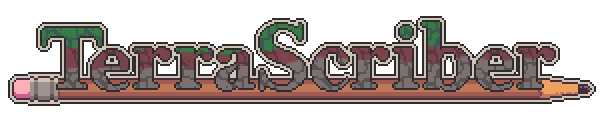
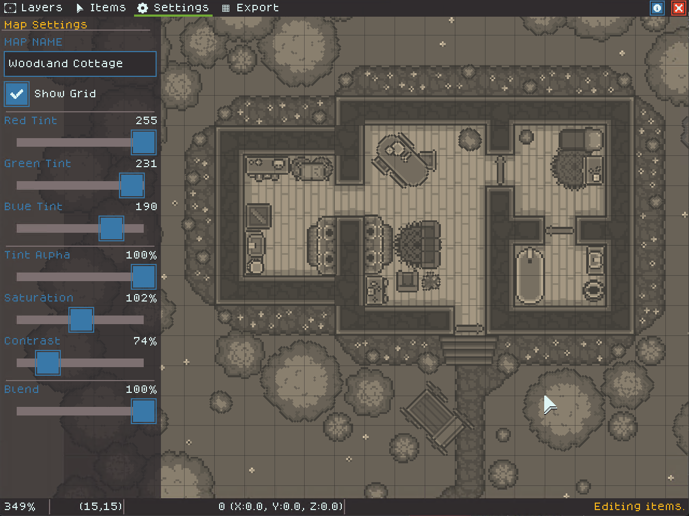

# Welcome to TerraScriber

<figure><figcaption></figcaption></figure>


To file bugs, request features, or request new asset packs, please [visit our community forums](https://narfox.itch.io/terrascriber/community) from the [TerraScriber store page](https://narfox.itch.io/terrascriber).


TerraScriber is a map making tool that enables GMs/DMs or artists to quickly make attractive maps for their physical or virtual tabletop gaming.

<figure><figcaption></figcaption></figure>

TerraScriber has these features for players and game masters:

* Create grid-based maps using Tile Layers - an auto-tiling system to quickly lay out map geometry.
* Place non-grid-based Items to decorate maps using rotation, duplication, flipping, and draw order.
* Apply effects to maps to control things like color saturation, contrast, and more.
* Powerful map exporting for digital (VTT) or print use, automatically slicing the map into common print sizes.
* Share maps with others as either a source file or an exported image.
* Import custom content packs to make maps for a wide variety of grid-based tabletop games.
* Robust fantasy map-making pack built into the tool!
* Create and share your own tile and item packs.

We recommend [checking out our Quickstart](getting-started/quickstart.md) for a no-frills explanation of how TerraScriber works!

### Links

* [Get TerraScriber on Itch.io](https://narfox.itch.io/terrascriber)
* [Check out our Dev Status](https://trello.com/b/a6j9ABxB/terrascriber)
* [File a bug](https://itch.io/t/4468451/bugs)
* [Request a feature](https://itch.io/t/4468466/feature-requests)
* [Request new art content](https://itch.io/t/4468470/art-requests)

