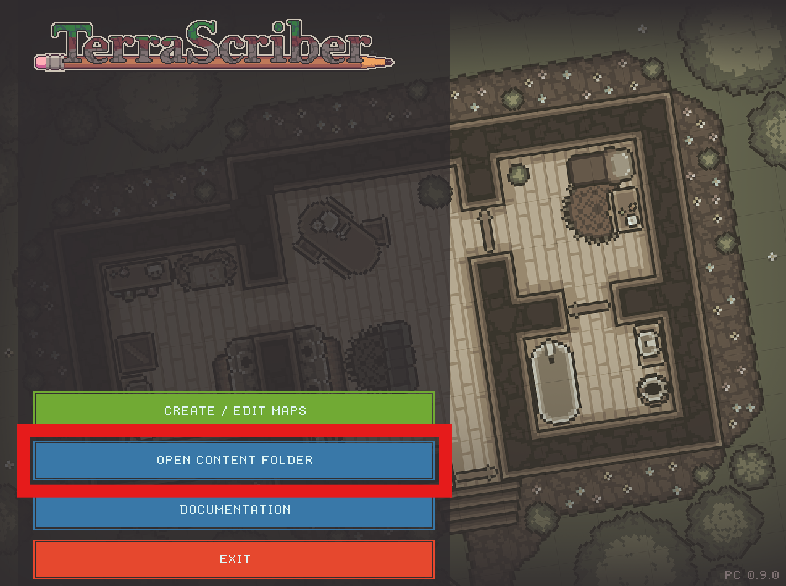
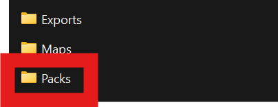

# Importing a Content Pack

A content Pack must be stored in a folder in TerraScriber's content directory. Pack names must be unique and the core packs are overwritten each time the application loads to ensure maps made with core assets are never broken.

Each Pack should be in a folder within the Packs directory, the folder name should match the Pack name, and each Pack should include a JSON file that defines the pack, and one or more png files containing the pack artwork.


In the future, TerraScriber may define some type of archive format that allows all Pack assets to be packaged and distributed together but for now Packs are kept simple to help both artists and users load Packs and diagnose issues!


To import a pack, first open the content folder using the button on the main menu:

<figure><figcaption></figcaption></figure>

Place your new Pack into the Packs directory. It must be in its own folder, see the "coreFantasy" pack for reference:

<figure><figcaption></figcaption></figure>
