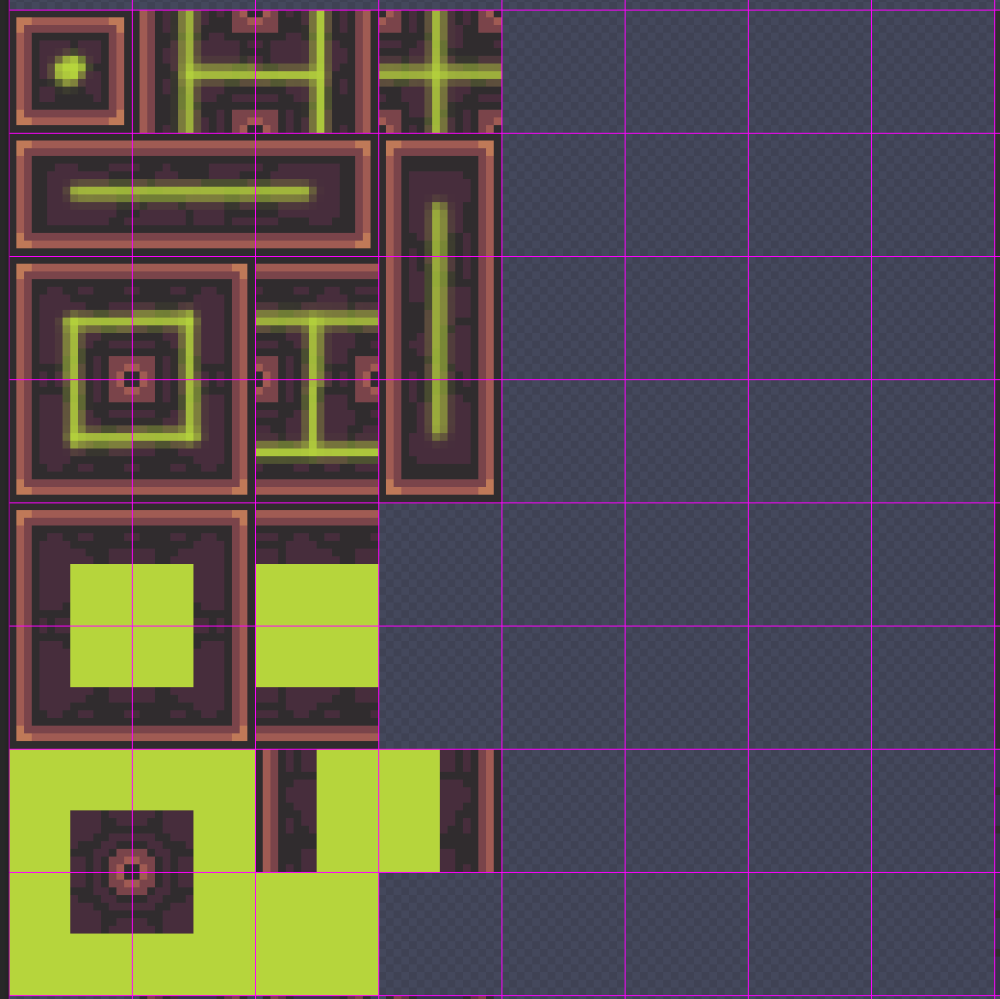
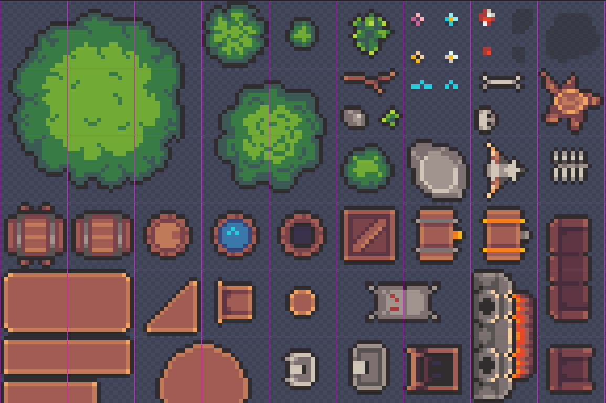

# Creator Quickstart

There are two primary types of content for TerraScriber: Items and Tile Layers. Both types of content are saved into a content `Pack` that can be loaded and used by map makers. This section offers advice for how to approach the art process and then how to share your content as a `Pack` with other users.


TerraScriber ships with a built-in pack called "coreFantasy". This pack is copied into the content directory every single time the application starts to encourage learning and experimenting with the example set without worrying about breaking compatibility.

If you make changes or name your set in a way that conflicts with the "coreFantasy" pack, your changes will be overwritten every time the application starts. This is important to prevent content creators from accidentally breaking all maps while trying to learn!

Looking at the coreFantasy pack is a great way to understand how Packs, TileSets, and ItemSets all work together.


You can use the "OPEN CONTENT FOLDER" button on the main menu to open and inspect the content that comes with the application.


All item coordinates in both TileSets and ImageSets are zero indexed and measured from the top-left corner of an image.


### Packs

A pack is just a [JSON ](https://developer.mozilla.org/en-US/docs/Learn_web_development/Core/Scripting/JSON)file that tells TerraScriber how to load your content. The pack JSON file is formatted as follows:

```json
{
  "name": "Core Fantasy",
  "description": "The fantasy content set that comes with the mapping tool!",
  "author": "Justin Johnson",
  "version": "1.0",
  "tileSets": [],
  "itemSets":[]
  }
```

* The `name` parameter is the name of your pack that will show up in the user interface.
* The `description`  parameter allows you to specify a description but currently does not appear in the TerraScriber tool.
* The `author` parameter allows you to specify the author but also does not appear anywhere in the TerraScriber tool.
* The `version` parameter is not yet used by the tool but allows content authors to add a version that shows which version of TileScriber the pack was built for. This allows us to add features with TileScriber but maintain a higher level of backwards compatibility with older content as the tool evolves.
* The `tileSets` parameter is an array of tile sets. See the section below for details on a tileset object.
* The `itemSets`  parameter is an array of item sets. See the Items section below for details on items.

The images used for item and tilesets can each be an individual png but this is not recommended. Instead, artists should consider placing all of the art for a pack into a spritesheet.

The folder name, JSON filename, and packname should match. The image(s) used by a pack and the JSON file must all be located in a folder together within the "Packs" folder where content is stored.

Changing your Pack name or other naming may break maps that use a pack!

### Tile Sets

A tileset is a collection of tiles that is associated with a layer to automatically render the correct tile in a layer layout. Consistent requirements for tilesets allow map makers to change the tileset for a whole layer at once to experiment with different looks.

A tileset is 8x8 tiles that are 16px square for a total tileset size of 128x128 pixels. The image below shows the required tile layout with the green overlay showing the tile type:

&#x20;

In the image above the line overlays show wall-like tile layouts including a standalone tile, tee intersections, corners, linear walls, and endcaps.

Below the wall-like tiles are tiles used for thicker solid areas. These tiles include inside and outside corners, edge tiles, and a solid fill tile.

There is significant empty space left, which may be used for tile variants or other features in the future.


Note that this tileset layout does not include every possible combination of tiles and does not currently support things like rounded corners. This was a purposeful design choice that greatly simplifies the process of creating new content!

For now, tileset creators can include Items that can be designed to tie into layers for unique things like rounded corners or special junctions.


Below is the JSON to define a TileSet:

```json
"tileSets": [
  {
    "setName": "CottageStone (Normal)",
    "texture": "coreFantasy.png",
    "offset": {
      "X": 0,
      "Y": 640
    }
  }
]
```

* The `setName` parameter defines the name of your tileset and is what is shown in UI. If you change this name, it may break maps that use this tileset.
* The `texture` parameter is the name of the image file with your tileset.
* The `offset`parameter allows you to specify the X and Y offset of your tileset in a large image file, allowing you to pack multiple TileSets and ItemSets into a single file.

### Item Sets

Items are objects that can be placed arbitrarily without aligning to a tile grid. Items can be rotated and flipped, and have their Z index be changed to control how they are layered together. However, items will always render on top of layers.

Items are just sprites on a sprite sheet and can be any size. Here is an example of some of the items that ship in the default "coreFantasy" pack that comes with TerraScriber:

<figure><figcaption></figcaption></figure>


Items must always "face" towards the right. This is important because TerraScriber allows users to both rotate and flip items. Items are flipped horizontally, which means if you do not "face" your items consistently towards the right they will not rotate and flip correctly.


Multiple items are defined into a collection called an ItemSet. For example, you might have a "Kitchen Items" set that includes plates, forks, knives, herbs, etc. Here is an example of item set JSON that defines a few items:

```json
"itemSets": [
  {
    "setName": "Fantasy Items",
    "texture": "coreFantasy.png",
    "items": [
      {
        "itemName": "Anvil",
        "leftPixel": 17,
        "topPixel": 193,
        "width": 20,
        "height": 7
      },
      {
        "itemName": "Axe",
        "leftPixel": 17,
        "topPixel": 201,
        "width": 14,
        "height": 6
      },
      {
        "itemName": "Barrel",
        "leftPixel": 34,
        "topPixel": 50,
        "width": 12,
        "height": 12
      }
  }
]
```

* The `setName` parameter defines the ItemSet name for a collection of items.
* The `texture` parameter defines the texture used by the items. All items in a set must share a texture.
* The `items` parameter is an array of Items

Each Item in an ItemSet must include these parameters:

* `itemName` - The unique name of the item in the set. Name items carefully so they are searchable and filterable. Changing an item's name may break maps that use that item!
* `leftPixel` - Defines the zero-indexed pixel on the leftmost side of the item.
* `topPixel` - Defines the zero-indexed pixel on the topmost side of the item.
* `width` - Defines the width of the item from the left pixel
* `height` - Defines the height of the item from the top pixel

This collection of properties allows the artist to define a square portion of a larger image for each item. Note that Items must occupy a rectangular space on the spritesheet, meaning that items with large concave areas cannot have other Items packed into the concave space!

### Final Tips

Here are some suggestions for creating great Packs that look good when combined with other packs:

1. **Consistent Palette** - The Core Fantasy pack that ships with TerraScriber uses the [Zughy 32 Palette defined on lospec.com](https://lospec.com/palette-list/zughy-32)
2. **Consistent "Readability"** - this is the idea of separating background, foreground, and items values so that it's easy to tell which parts of a map are passable or blocked, and what objects are items on the map. Use lighter colors for floors and darker colors for solids and walls. Outline items in dark or black outlines. This also helps maps look good when effects are applied.
3. **Consistent Scale** - A square tile is assumed to be roughly 5' or 1.5 meters across. Keeping this in mind and measuring or looking up measurements for items will help your content look consistent when used in combination with other artists work!
4. **Consistent Searchability** - Since item names are what maps reference to load items from a pack, you need to keep your naming consistent. Consider using a naming scheme like `[item type] [item material] [item size]` so that your items have names like "Chair Wooden Medium". This allows users to filter for "Chair" and see related items grouped together.
