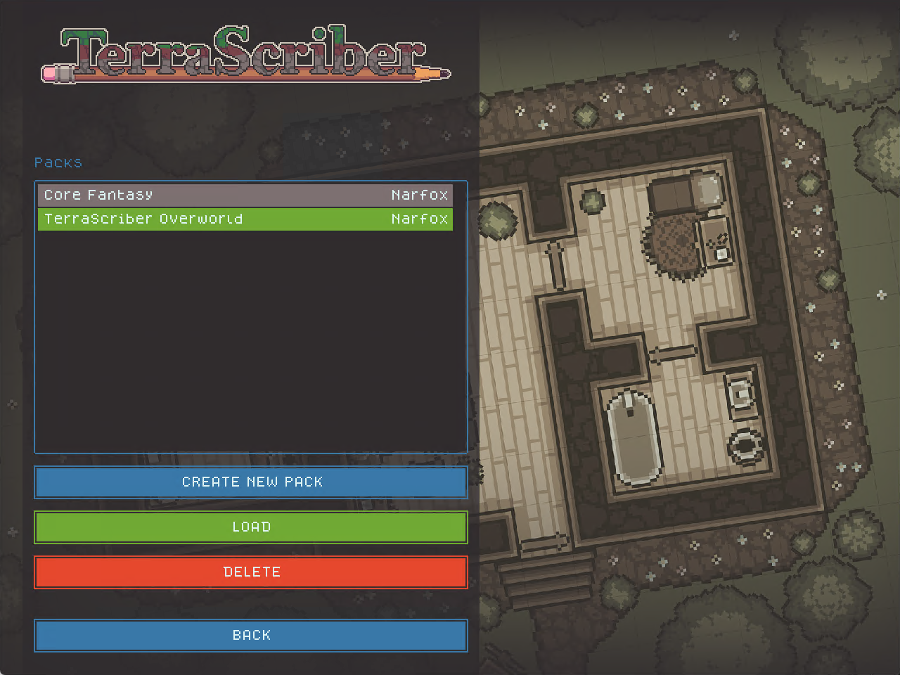
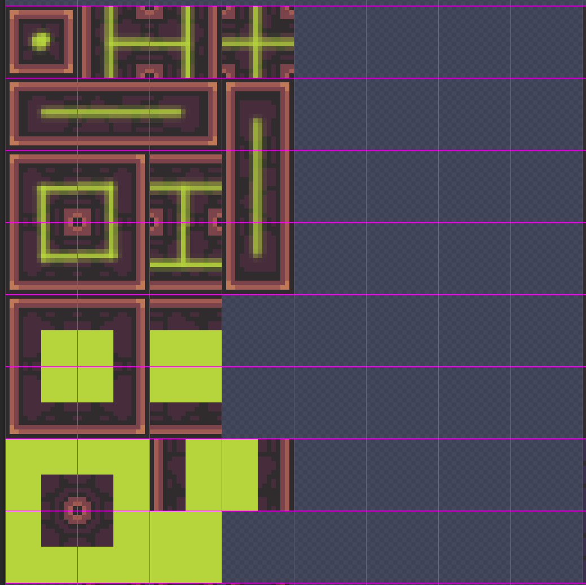
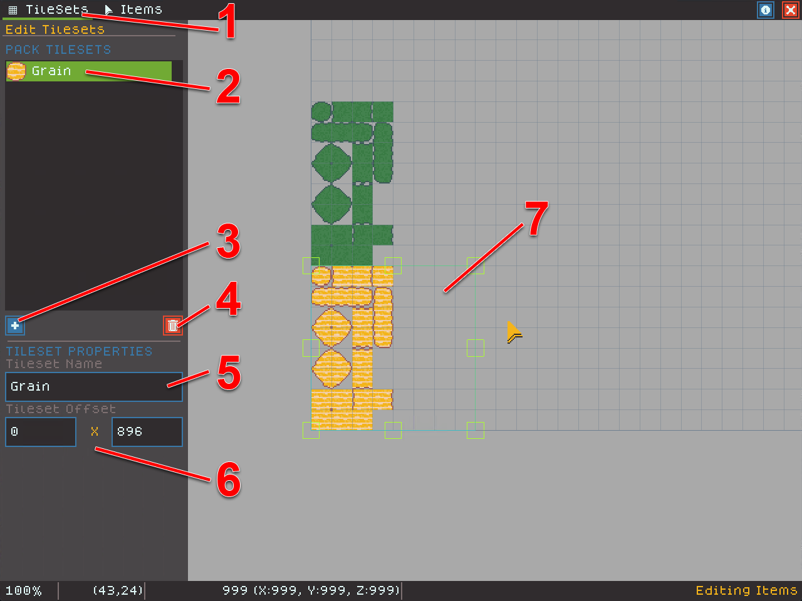
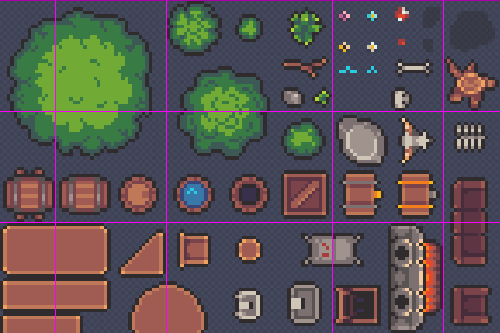
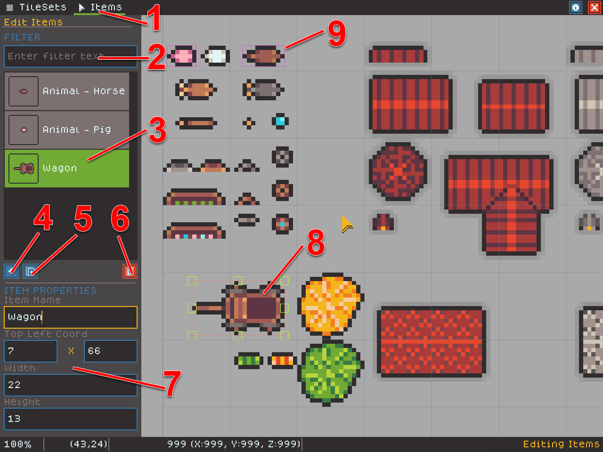

# Creator Quickstart

There are two primary types of content for TerraScriber: Items and Tile Layers. Both types of content are saved into a content `Pack` that can be loaded and used by map makers.

Starting with v1.3, we have put a lot of effort into making Item and Tileset creation as easy as possible.


TerraScriber ships with a built-in pack called "coreFantasy". This pack is copied into the content directory every single time the application starts to encourage learning and experimenting with the example set without worrying about breaking compatibility.

If you make changes or name your set in a way that conflicts with the "coreFantasy" pack, **your changes will be overwritten every time the application starts**. This is important to prevent content creators from accidentally breaking all maps while trying to learn!

Looking at the coreFantasy pack is a great way to understand how Packs, TileSets, and ItemSets all work together.


You can get started editing content from the main menu, by clicking the CREATE/EDIT PACKS button.

### TerraScriber Content Pack

A `Pack` consists of two pieces: a png file that contains all of the art used by the pack into a single spritesheet, and a JSON file that defines the items and tilesets in the pack.

Packs define Items - images that can be placed arbitrarily and rotated or flipped, and Tilesets - tiles that can be used to create water, walls, and other terrain that is aligned to a grid.

It is a good idea to organize packs into thematic collections, for example an overworld, dungeons, or villages that contains items and tilesets that work together.


TerraScriber generates unique IDs for content packs and all items and tilesets within a pack. It is _**strongly recommended**_ that you do not edit the IDs that are automatically created for your content. This helps prevent ID collisions for users that may be using content packs from a variety of sources!


### Creating a Pack

On the Pack Chooser screen, you can select an existing pack to edit or create a new pack. When you create a new pack, TerraScriber will create a folder and a JSON file to hold all of the pack data. **TerraScriber expects you to add an image in this folder with a name that matches the JSON file** before you can edit the pack! This is because the first step in editing a pack is to load the image associated with a pack.

You can use the "OPEN CONTENT FOLDER" button on the main menu to open and inspect the content that comes with the application and add an image to your Pack.

<figure><figcaption></figcaption></figure>

### Tile Sets

A tileset is a collection of tiles that is associated with a layer to automatically render the correct tile in a layer layout. Consistent requirements for tilesets allow map makers to change the tileset for a whole layer at once to experiment with different looks.

#### Creating Tileset Art

A tileset is 8x8 tiles that are 16px square for a total tileset size of 128x128 pixels. The image below shows the required tile layout with the green overlay showing the tile type:

&#x20;

In the image above the line overlays show wall-like tile layouts including a standalone tile, tee intersections, corners, linear walls, and endcaps.

Below the wall-like tiles are tiles used for thicker solid areas. These tiles include inside and outside corners, edge tiles, and a solid fill tile.

There is significant empty space left, which may be used for tile variants or other features in the future.


Note that this tileset layout does not include every possible combination of tiles and does not currently support things like rounded corners. This was a purposeful design choice that greatly simplifies the process of creating new content!

For now, tileset creators can include Items that can be designed to tie into layers for unique things like rounded corners or special junctions.


#### Defining Pack Tilesets

Once you have added tileset art to the png file associated with your pack, you can define the tilesets in TerraScriber. Load your pack for editing from the Pack Chooser screen and add or edit Tilesets in the tileset editing mode:

<figure><figcaption>
Editing Tilesets in TerraScriber
</figcaption></figure>

1. Select TileSets to edit tilesets in your Pack
2. The tileset list shows the tilesets defined in your pack. If the tileset is correctly aligned, the preview image will be the self-contained tile.
3. Add a new tileset
4. Delete the selected tileset
5. Edit the tileset name
6. Manually edit tileset coordinates
7. Drag the scalable rectangle box to visually align tileset. Note that tilesets are a fixed size so dragging the rectangle handles will not alter the size

Any defined tilesets will be outlined on the image with a faint border so you can see which tilesets in the image have been defined in the pack.

### Item Sets

Items are objects that can be placed arbitrarily without aligning to a tile grid. Items can be rotated and flipped, and have their Z index be changed to control how they are layered together. However, items will always render on top of layers.

#### Item Art

Items are just sprites on a sprite sheet and can be any size. Here is an example of some of the items that ship in the default "coreFantasy" pack that comes with TerraScriber:

<figure><figcaption>
Items on a Spritesheet
</figcaption></figure>


Items must always "face" towards the right. This is important because TerraScriber allows users to both rotate and flip items. Items are flipped horizontally, which means if you do not "face" your items consistently towards the right they will not rotate and flip correctly.


Defining Pack Items

Once you have added item art to the png file associated with your pack, you can define the tilesets in TerraScriber. Load your pack for editing from the Pack Chooser screen and add or edit Items in the item editing mode:

<figure><figcaption>
Editing Items in TerraScriber
</figcaption></figure>

1. Select Items to edit items in your Pack
2. The filter box allows you to filter the item list to find items easier
3. The item list, showing which item is selected for editing
4. Add a new item
5. Duplicate the selected item
6. Delete the selected item
7. Manually edit item name and coordinates
8. Edit item bounds by dragging rectangle or resizing with handles
9. Mapped items will show a border so you can see which items in the image have not been defined as pack items


When defining items, consider prefixing or postfixing related items with a filterable term, such as "Animal" in the image above. This allows users to filter to related items when editing maps. For example, filtering on "Animal" will refine the list to only show types of animals and make it much easier to use items in the map!


### Distributing Your Pack

It should go without saying that all relevant copyright law applies to content created for TerraScriber. You should not create packs with art you don't own the correct rights to. TerraScriber and its parent company Narfox do not have a mechanism to prevent or enforce content licensing. Any content you choose to create and distribute is your sole responsibility.

Packs are automatically saved whenever you change a tileset or item, or when exiting the edit experience and returning to the Pack Chooser screen. Note that closing the application entirely could result in your most recent edit not being saved.

Since a Pack is just a JSON file and a PNG image in a folder, the easiest way to distribute a pack is to zip the pack folder and then share the pack however you want! You may want to include a license text file in your pack if you want to specify usage rights.
