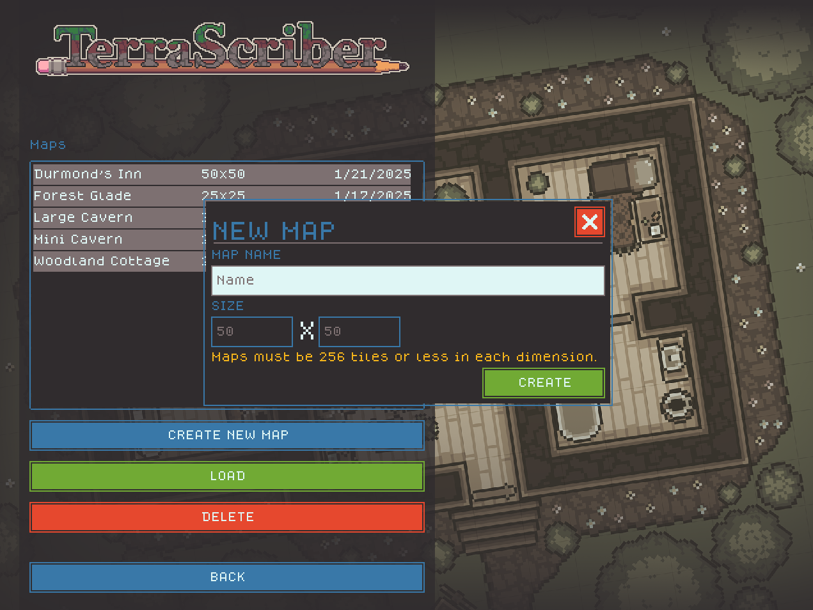

# Creating/Loading Maps

<figure><figcaption></figcaption></figure>

Click "CREATE/EDIT MAPS" on the main menu to start creating or editing maps.

On the map loading screen, clicking "CREATE NEW MAP" will open a dialog allowing you to choose the name and size of the map. Clicking the "CREATE" button will add a new, empty map with the specified name and size to the list.

Click "LOAD" to load the selected map for editing.
