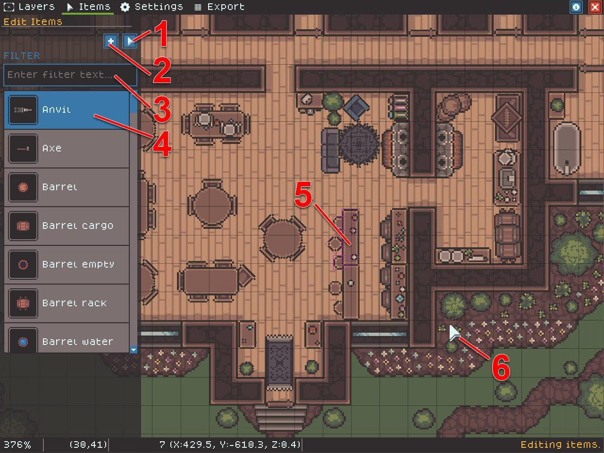

# Editing Items

Item Editing allows you to place non-grid-aligned items to decorate your map.

The following image shows tools unique to editing Items.

<figure><figcaption></figcaption></figure>

1. The Item selection cursor. Use this tool to edit and duplicate existing items.
2. The Item placement cursor. Use this tool to add new items to the map.
3. This text box filters the list of items based on the entered text.
4. The item list shows all items loaded from all available packs with a preview of the item.
5. Selected items will be outlined in magenta. The following keys edit your selected items:
   1. `D`: duplicate the selection.
   2. `Z`: to rotate the selection, holding the SHIFT key will rotate in smaller increments.
   3. `X`: to flip the selection.
   4. `ARROWS`: nudge the selection.
   5. `+`: increase item layer.
   6. `-`: decrease item layer.
   7. `DELETE`: delete the selection (**this action has no undo**)
6. The cursor, when in placement mode, the item-to-be-placed will show faintly below the cursor.
