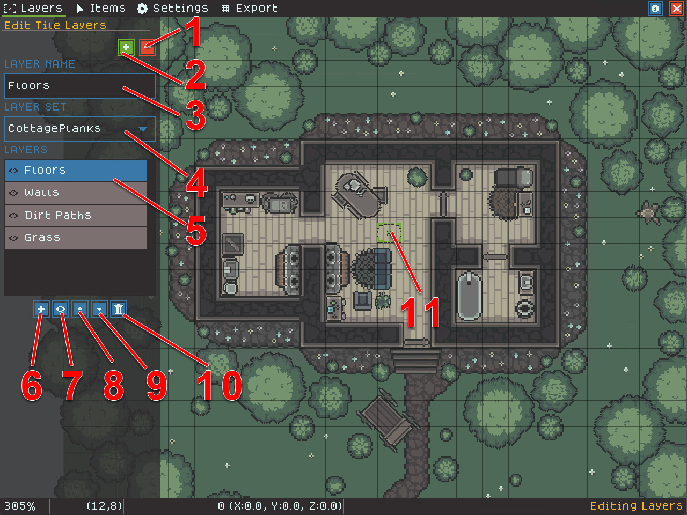

# Editing Layers

Layers in TileScriber are grid-based tiles that define the main map "geometry" - things like grass, paths, water, walls, and floors.

To edit layers, create and name your layer and choose a TileSet for the layer to use. TileSet can be changed at any time so feel free to experiment with TileSets for the look you want!

The following image shows unique layer editing tools and their functionality is defined below.

<figure><figcaption></figcaption></figure>

1. Remove tiles mode (shortcut `-`)
2. Add tiles mode (shortcut `+`)
3. Current layer name.
4. Tileset used by the current layer. Changing this will change all tiles in the layer!
5. Layer list showing selected layer.
6. Add New Layer button
7. Show/Hide selected layer
8. Move selected layer up (higher layers render on top of other layers)
9. Move selected layer down (lower layers render below other layers)
10. Delete selected layer (**this action has no undo**)
11. Layer editing cursor, the color indicates whether you are adding or removing tiles
