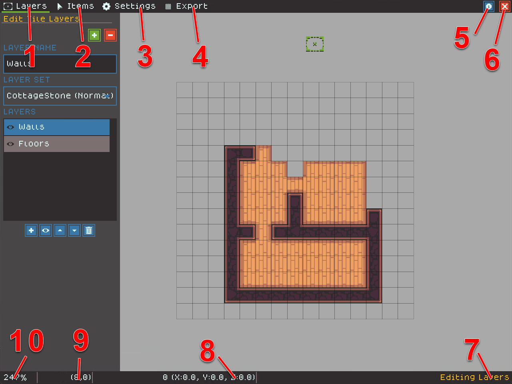

# Editor Overview

Editing in TerraScriber has four modes. First, creators typically create and edit Layers to form their main map geometry. Next, creators add and arrange Items to decorate their map. Then, they edit the Settings to control the overall color tone and effects, Finally, they export their map to print or use in their favorite VTT.

The following image shows overall editor tools and information areas:

<figure><figcaption></figcaption></figure>

1. The Layers menu item moves the editor into Layer editing mode (shortcut `1`).
2. The Items menu moves the editor into Item editing mode (shortcut `2`).
3. The Settings menu moves the editor into Settings mode (shortcut `3`).
4. The Export menu moves the editor into Export mode (shortcut `4`).
5. The Info button opens a dialog showing shortcut keys.
6. The Exit button saves the map and returns to the map chooser screen.
7. The Info area shows the current action and other useful information.
8. The coordinates area shows the number of items selected and the average of their pixel coordinates.
9. The grid coordinates area shows the current grid coordinate of the cursor
10. The zoom area shows the current zoom level
