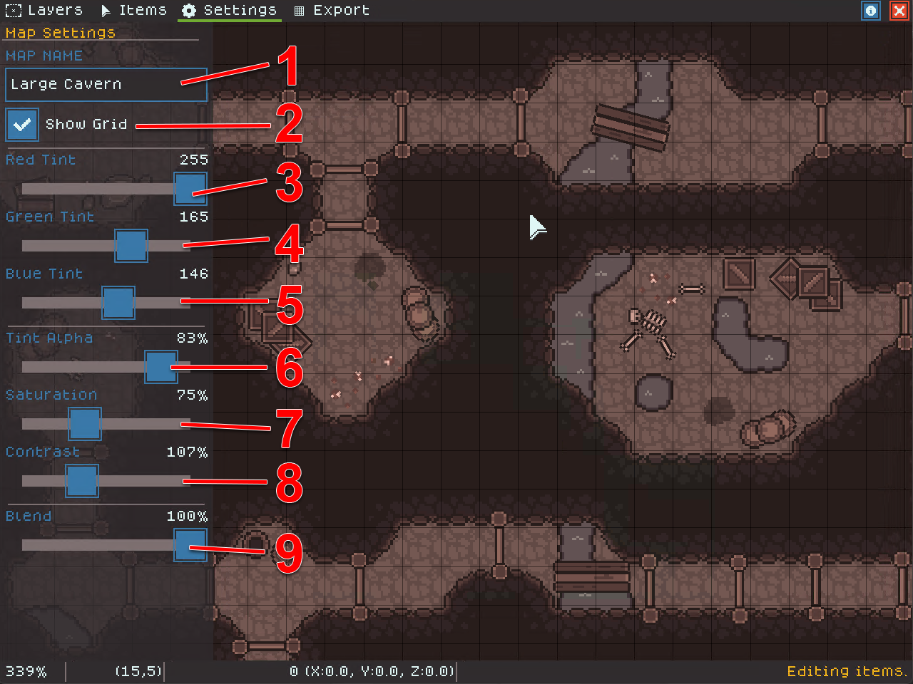

# Effects & Settings

Settings Mode allows you to edit overall map settings, especially the visual effects applied!

Visual effects allow you to adjust the overall tone and contrast of your map. This can be helpful to give your map a "mood", tweak settings for printing, or achieve an effect such as sepia tone.

<figure><figcaption></figcaption></figure>

1. Map name - editing this will also change your save file name so you can append things like "v1" to create versioned maps.
2. Show Grid toggles the map grid on and off (shortcut `CTRL G`)
3. Red Tint affects the amount of red tint applied to the map.
4. Green Tint affects the amount of green tint applied to the map.
5. Blue Tint affects the amount of blue tint applied to the map.
6. Tint Alpha affects the total tint strength applied.
7. Saturation affects the color saturation applied. Zero saturation is black and white.
8. Contrast affects the map contrast. Changing this value can affect the mood, readability, or printability of the map.
9. Blend is the mixture of plain map colors with the applied effects. Zero means all of the slider effects are not applied at all. One hundred percent means all of the effects are fully applied.

Check out the [Effects Examples page](../getting-started/effects-examples.md) to get more ideas on how to use effect settings on your map!

