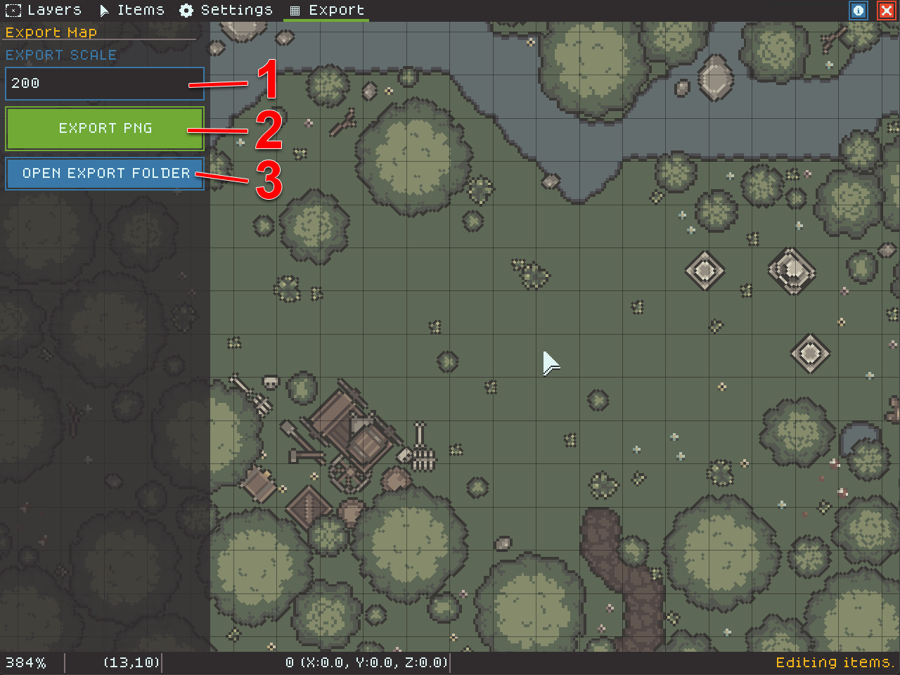

# Exporting Your Map

The Export mode allows you to export your map at a specific zoom level. Map tiles are 16px, so you can figure out your total export dimensions as follows:

`Tilesize * ExportScale * 16`


The maximum Export Scale is dictated by your hardware - usually your graphics card. It is recommended that you do not try exporting maps larger than 4000x4000 pixels. If you do, make sure your map is saved in case you crash TerraScriber!


The image below shows the options available in Export mode.

<figure><figcaption></figcaption></figure>

1. The scale percent is how big your map will export. Two hundred, the default, will export your map at 200% of the actual pixel size.
2. Clicking the "EXPORT PNG" button will save your map to disk at the provided export size. The grid will be rendered in the exported image if it is on.
3. Clicking "OPEN EXPORT FOLDER" will open the folder where exported images are saved.

### VTT Tips

When scaling images, most programs will do "multi-sampling" which softens edges as it scales. If you export your image at 100%, this may result in it looking blurry in your favorite VTT.

TerraScriber is designed to scale exported images so that pixels stay crisp. Try exporting at different scales to see what looks best in your favorite VTT!

### Printing Tips

Exporting your map to print takes a little bit of math. You probably want at least 150dpi (pixels/dots per inch) when printing, and you probably want your map to print at 1" scale for the grid.

Tiles in TerraScriber are 16px, so if you want to be able to print your map at 150dpi, you need to export at roughly 940%. A 150dpi print at 940% should be very, very close to a 1" scale. However, this results in a _very_ large image very quickly. A 10x10 map at 940% will be roughly 15,000 pixels in each dimension and the export may fail.


**If printing at high resolution is important to you, please drop into our** [**Feature Request Forums and let us know**](https://itch.io/t/4468466/feature-requests)**! We are considering adding more advanced export functions that could export the map in printer-sized chunks. This is a significant feature and we want to understand what our users want before we build it!**

