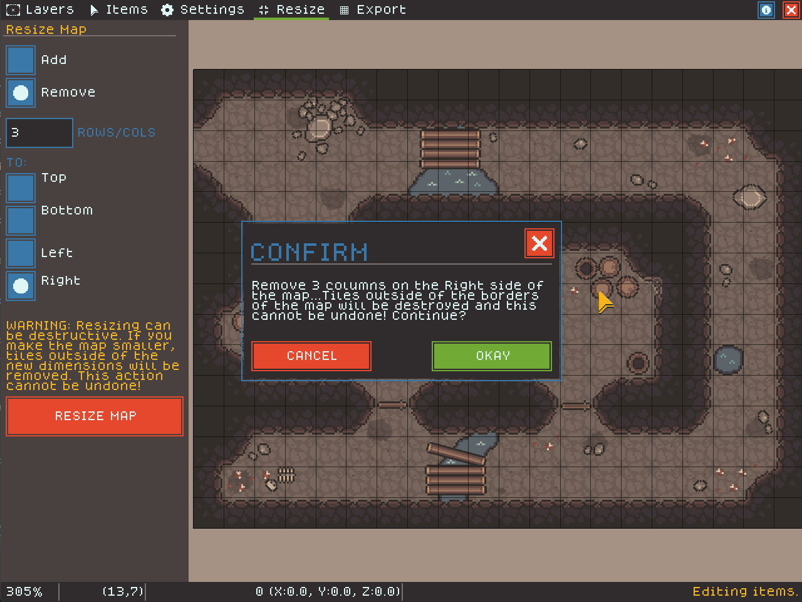

# Resizing Your Map

The resize mode allows you to change the dimensions of your map - essentially cropping it.

Since resizing can be destructive and complicated to understand, we have tried to make resizing granular and easy to understand. However, this does mean that resizing may take a few steps if you need to change multiple dimensions.

<figure><figcaption></figcaption></figure>

Resizing a map takes three steps:

1. Choose whether you want to add or remove tiles using the first set of radio buttons.
2. Choose how many columns or rows you want to remove.
3. Choose which side you want to affect by either adding or removing columns.

Resizing cannot be undone and removing tiles means destroying tiles outside of the new dimensions. Items that fall outside of the new dimensions will be left on the map for you to decide whether to move or destroy.
