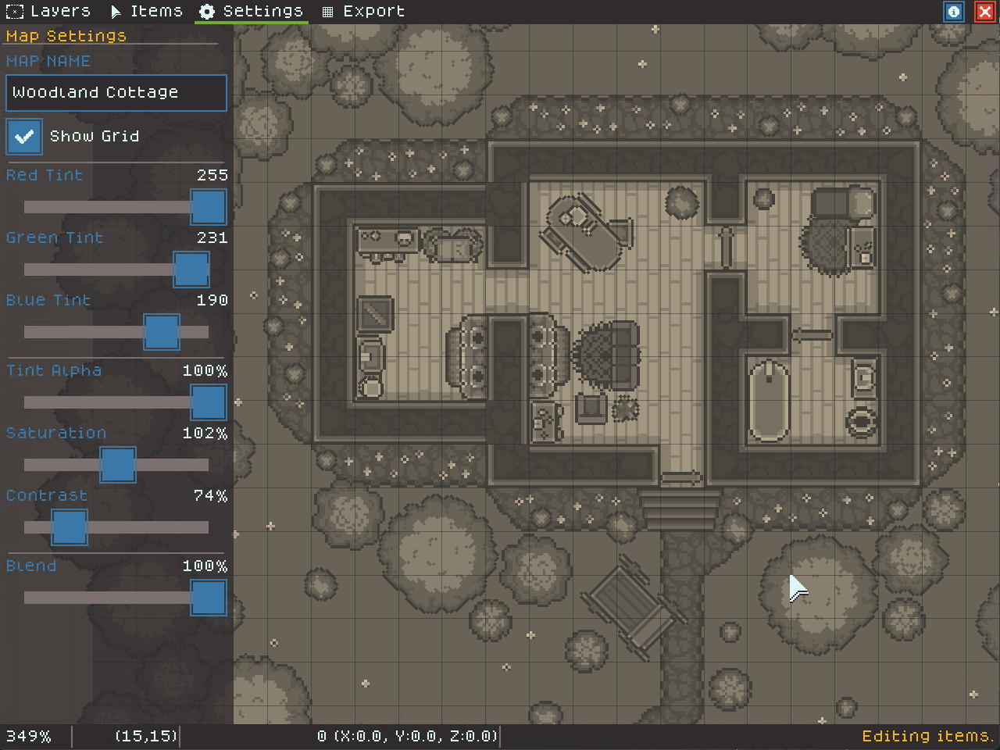

# Effects Examples

You can use the effects sliders in the Editor's Settings mode to get a wide variety of effects. Often color-shifting the map, even slightly, helps give the map a unified feel by bringing all of the colors together. This page shows how to achieve some specific styles using the settings sliders.

### Default

This image shows a map with default colors. This helps see how the other effects below alter the look of the map. You can turn the "Blend" slider down at any time to compare your effect with the default colors.

<figure><figcaption></figcaption></figure>

### Printer Friendly

The following image shows the example map with it's contrasted boosted and the saturation turned all the way off. Tweaking the contrast settings may help you export a map that prints well on a laser or other black and white printer.

<figure><figcaption></figcaption></figure>

### Sepia Tone

Sepia tone gives a classic, old map feeling. Turn the tint alpha to max and experiment to get your desired sepia tone. Turning the contrast down will make the map feel more worn and washed out.

<figure><figcaption></figcaption></figure>

### Purple Caverns

Tinting the map with purples or blues can give a "magic cavern" feeling. Using more red can give a hot or lava-like feeling. Try this with an interior map design for best effect.

<figure><figcaption></figcaption></figure>

### Warm Meadow

Tinting with warm greens and yellows can make a meadow feel warm and sunny. It can also make a cave feel poisonous or irradiated!

<figure><figcaption></figcaption></figure>

