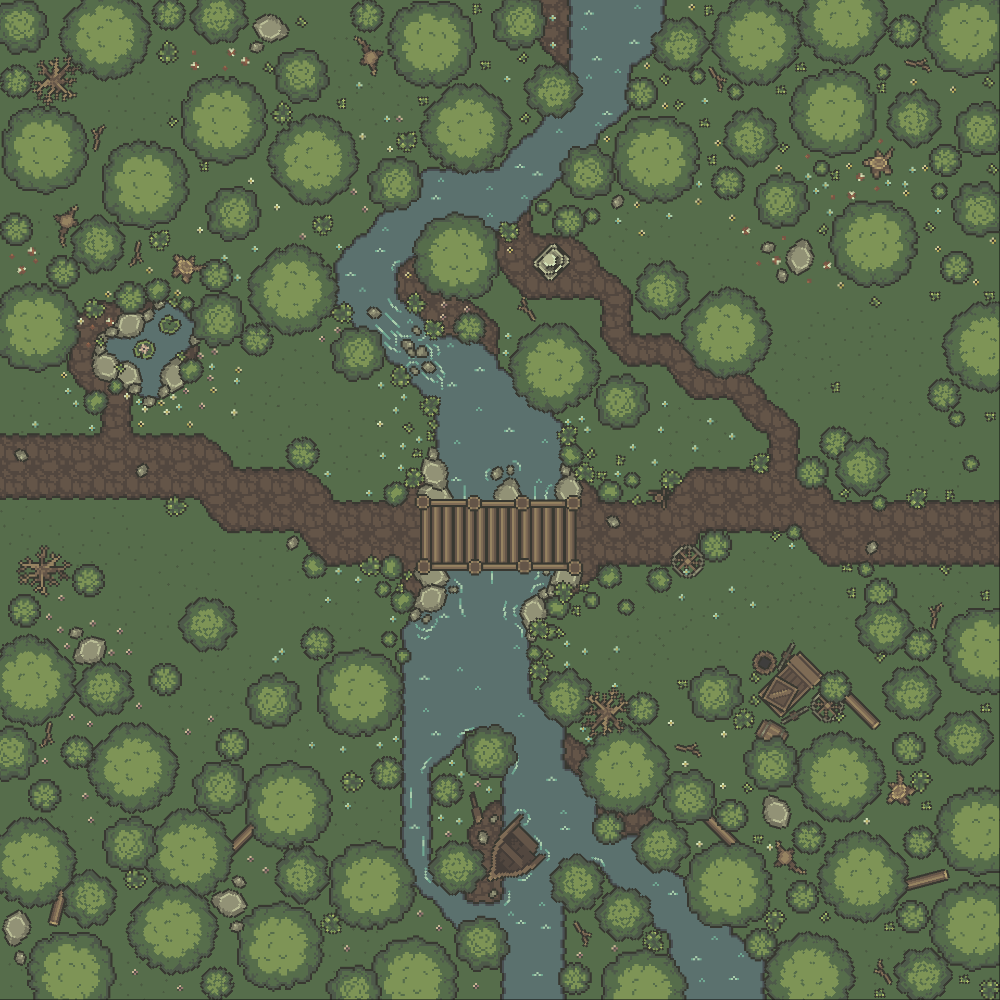

# v1.1.X

v1.1 adds new art, a lot of quality-of-life improvement, and starts adding some critical features that didn't make the v1.0 release (map resizing!). Here's a list of features and bugfixes that shipped in v1.1.


We listen to your feedback: check out our progress on community requests!


### Community Bugs & Requests

* Entering non-numeric characters in mouse creation
* Double-clicking a map now loads the map immediately
* Unresolvable tiles now render as a self-contained tile instead of an ugly square
* Select all (`CTRL A`) now works correctly in text boxes
* Placing vs selecting items is now clearer, easier to swap between
* The tile selection rectangle no longer gets stuck when released over UI
* Clicking while "Map has no layers" dialog is active no longer crashes
* Clicking "Delete Map" while the map list is empty no longer crashes
* Clicking visibility icon while map has no layers no longer crashes
* New maps now show the grid by default
* Map now has a bounding rectangle, even when grid is off, so you can always see the map borders

### Roadmap Features

* Gr**id color is now editable!**
* **Maps can now be resized!**
* **Item filtering performance/responsiveness has improved by about 40x!**
* Nudging items with arrow keys now snaps to nearest pixel (helps precisely align to whole pixels which is critical for aligning things like railroad tracks)
* Clicking an item in the item list switches to item placement
* Right clicking in item placement mode switches back to selecting items
* Right clicking in layer mode switches between add and remove tiles
* Item selection is more intelligent, selecting the topmost item and adding or removing to the current selection is more intuitive
* Selection rectangle no longer appears under items sometimes
* Map effects no longer change selection outlines and selection colors (this made it hard to see what is selected)
* Newly created maps now immediately load for editing
* Mouse icon is now more visible and doesn't blend into hover states

### Art

* Outdoor Art
  * Water waves/ripples (multiple variants)
  * Dead trees (two variants)
  * Lilly pads (two variants)
  * Palm leaves
  * Camp tent
  * Campfire (lit and unlit)
  * Bedroll
  * Cook spit and roasted animal carcass
  * Cauldron
  * Small boat (whole and broken)
  * Boat mast
  * Boat sail (two variants)
  * Oar (whole and broken)
  * Small rocks (multiple variants)
* Cave Art
  * Improved cave and path tilesets
  * Mining rails (many variants)
  * Mining cards (two variants)
  * Pick
  * Crate and barrels with gemstones (multiple variants)
* Misc Art
  * Large hewn stones (two variants)
  * Stair treads for rounded stairs (two variants)
  * Books (four variants)
  * Papers (multiple variants)
  * Inkwell and pen
  * Open book
  * Spider web
  * Added faint dots called "Sprinkles" that add texture, especiall to grass

The following map showcases how the new waves, stones, lilly pads, boat, and dead trees give your outdoor landscapes a lot of exciting detail!

<figure><figcaption></figcaption></figure>

