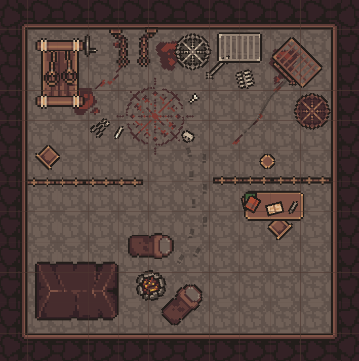

# v1.2.X

v1.2 focuses on an undo system as the primary new feature. It also adds some new art and addresses multiple community feature and bugfix requests (THANK YOU 🥰).


The undo/redo system added by this update is a large and complex feature that also required making substantial changes to how map data is saved. Please report bugs in the TerraScriber community forums (available from the store page)!


### Community Bugs & Requests

* Fixed issue with filtering not working correctly when using capital letters
* Double clicking a map on the map loading screen now loads it
* Visible icon on layers is now clickable
* Tileset dropdown now shows a preview of the tileset
* Layer list now shows a preview of the tileset used by the layer
* Adding a layer now adds above the selected layer, not below

### Roadmap Features

* Added an undo/redo system
* Refactored map data to be more abstracted and thus easier to add future features
* Map saved version is now updated to match the game version (which helps with future backwards compatibility)

### Art

* Added square metal cages (two variants)
* Added round metal cages (two variants)
* Added bars and doors (two variants of each)
* Added footprints (four variants)
* Added scratches (two variants)
* Added bloodstains (multiple)
* Added occult floor symbol
* Added dirty bedroll
* Added ragged tent
* Added rack components
* Added pliers
* Added manacles

Preview of some of the new art!

<figure><figcaption></figcaption></figure>
